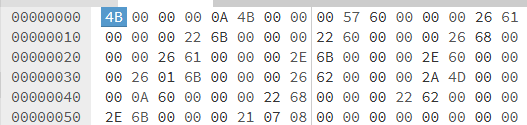
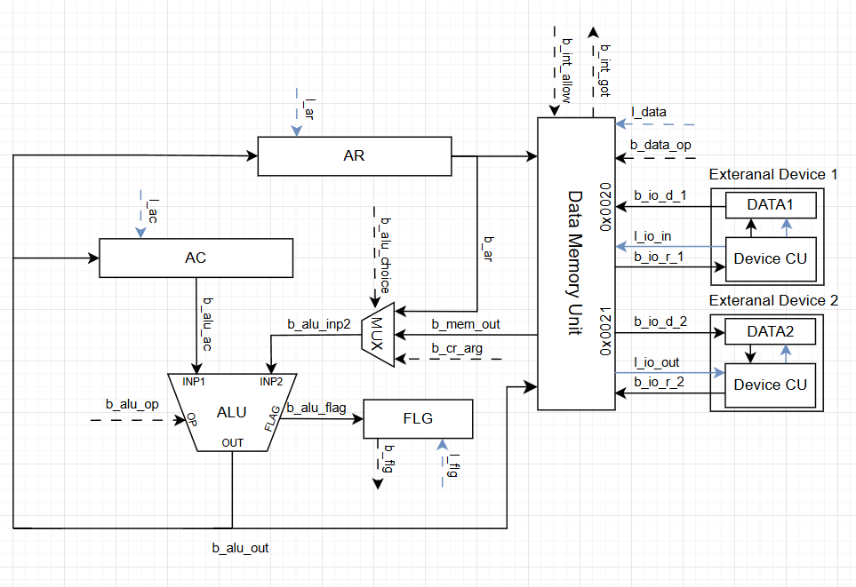
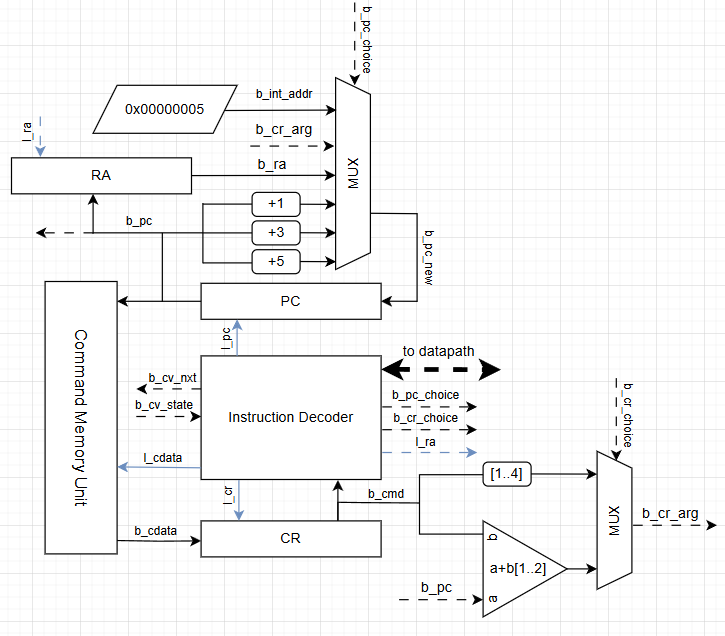
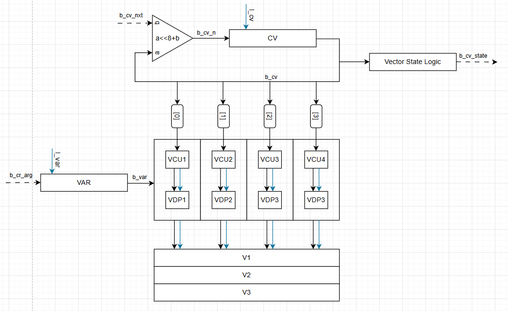
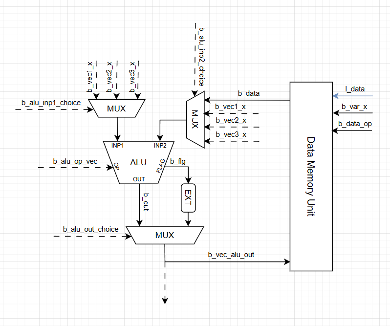

# Лабораторная работа №4

---

- Выполнил: Назин Артем Аркадьевич, P3207
- `asm | acc | harv | hw | tick | binary | trap | mem | cstr | prob2 | vector`

## Язык программирования

### Синтаксис

Расширенная форма Бэкуса-Наура:

```ebnf
program ::= <data_sec> <text_sec> <int_sec> | <text_sec> <int_sec> 

<data_sec> ::= <s_all> ".section" <s_plus> "data" <s_all> "\n" (<org> | <data_decl> | <lbl_str> | <empty>)*
<text_sec> ::= <s_all> ".section" <s_plus> "text" <s_all> "\n" (<org> | <cmd> | <lbl_str> | <define> | <undef> | <def_usage> | <empty>)*
<int_sec>  ::= <s_all> ".section" <s_plus> "int"  <s_all> "\n" (<org> | <cmd> | <ret> | <lbl_str> | <empty>)*

<s_all>  ::= ("\t" | " ")*
<s_plus> ::= ("\t" | " ")+
<empty> ::= <s_all> "\n"

<org> ::= <s_all> ".org" <s_plus> (<hex> | <pos_dec> | <zero>) <s_all> "\n"
<define> ::= <s_all> "#define" <s_plus> <def_name> <s_all> "\n"
<undef> ::= <s_all> "#enddefine" <s_all> "\n"
<def_name> ::=  "\w+"
<def_usage> ::= <s_all> <def_name> (<s_plus> (<data> | <hex> | <dec> | <str> | <label>) )* <s_all> "\n"

<data_decl> ::= <s_all> (<lbl_data_decl> | <no_lbl_data_decl>) <s_all> "\n"
<lbl_data_decl> ::= <label_decl> <s_plus> <no_lbl_data_decl>
<no_lbl_data_decl> ::= <data_type> <s_plus> <data> 
<data_type> ::= ".word" | ".byte"
<data> ::= <data> <s_plus> <data> | <hex> | <dec> | <str> | <label>

<hex> ::= "0x[a-f0-9]{1,6}"
<dec> ::= <pos_dec> | <neg_dec> | <zero>
<neg_dec> ::= "-" <pos_dec>
<pos_dec> ::= [1, 2^31-1]
<zero> ::= "0"

<str> ::= "'\w+'"
<label_decl> ::= "\w+:"
<label> ::= "\w+"
<lbl_str> ::= <s_all> <label_decl> <s_all> "\n"

<ret> ::= <s_all> "ret" <s_all> "\n"
<cmd> ::= <s_all> (<lbl_cmd>|<no_lbl_cmd>) <s_all> "\n"
<lbl_cmd> ::= <label_decl> <s_plus> <no_lbl_cmd>
<no_lbl_cmd> ::= <mnemonik> | <mnemonik> <s_plus> <cmd_op> 
<cmd_op> ::= <label> | <dec> | <hex> | <lit> 

<lit> ::= "'\w'"
<mnemonik> ::= "inc" | "dec" | "inc4" | "dec4" | "inc" | "neg" | "halt" 
| "ld" | "add" | "sub" | "and" | "or" | "xor" | "shiftl" | "shiftr" | "mul" | "div" 
| "rem" | "ld_a" | "add_a" | "sub_a" | "and_a" | "or_a" | "xor_a" | "shiftl_a"  
| "shiftr_a" | "mul_a" | "div_a" | "rem_a" | "jmp" | "jz" | "jnz" | "jgt" 
| "jlt"  | "jc" | "jnc" | "jv" | "jnvr" | "st" | "ld_ind" | "st_ind" | "jzr" 
| "jnzr" | "jgtr" | "jltr" | "jcr" | "jncr" | "jvr" | "jnvr"

```

### Семантика
- `arr: .word 0 1 2 3`  -- объявление данных в памяти данных
- `.section data`  -- объявление того, что дальнейшее следует воспринимать как объявление данных секции `data`
- `.section text`  -- объявление того, что дальнейшее следует воспринимать как инструкции секции `text`
- `.section int`  -- объявление того, что дальнейшее следует воспринимать как инструкции секции `int`
- `#define <name>`  -- объявление начала макроопределения 
- `#enddefine <name>`  -- объявление конца макроопределения 
- `ld <cmd_op>`  -- загрузить значение непосредственно (immediate) в AC
- `add <cmd_op>` -- сложить значение из AC и указанное значение и защелкнуть в AC
- `sub <cmd_op>` -- вычесть из AC указанное значение 
- `and <cmd_op>` -- побитовое И значения из AC и указанного значения
- `or <cmd_op>`  -- побитовое ИЛИ значения из AC и указанного значения
- `xor <cmd_op>` -- побитовое Исключающее ИЛИ значения из AC и указанного значения
- `shiftl <cmd_op>` -- логический сдвиг AC влево на указанное значение бит 
- `shiftr <cmd_op>` -- логический сдвиг AC вправо на указанное значение бит 
- `mul <cmd_op>` -- умножить AC на указанное значение 
- `div <cmd_op>` -- целочисленно поделить AC на указанное значение 
- `rem <cmd_op>` -- защелкнуть в AC остаток от деления значения AC на указанное значение 
- `add_a <cmd_op>`, `sub_a <cmd_op>`, `and_a <cmd_op>`, `or_a <cmd_op>`, 
`xor_a <cmd_op>`, `shiftl_a <cmd_op>`, `shiftr_a <cmd_op>`, `mul_a <cmd_op>`, 
`div_a <cmd_op>`, `rem_a <cmd_op>` -- аналогично предыдущей семантике, 
но вместо непосредственного значения (immediate) берется значение `mem[<cmd_op>]`
- `jmp <cmd_op>` -- изменяет значение регистра PC на указанное значение
- `jz <cmd_op>` -- изменяет значение регистра PC на указанное значение если установлен флаг `Z`
- `jnz <cmd_op>` -- изменяет значение регистра PC на указанное значение если не установлен флаг `Z`
- `jgt <cmd_op>` -- изменяет значение регистра PC на указанное значение если не установлен флаг `N`
- `jlt <cmd_op>` -- изменяет значение регистра PC на указанное значение если установлен флаг `N`
- `jc <cmd_op>` -- изменяет значение регистра PC на указанное значение если установлен флаг `C`
- `jnc <cmd_op>` -- изменяет значение регистра PC на указанное значение если не установлен флаг `C`
- `jv <cmd_op>` -- изменяет значение регистра PC на указанное значение если установлен флаг `V`
- `jnv <cmd_op>` -- изменяет значение регистра PC на указанное значение если не установлен флаг `V`
- `jr <cmd_op>`, `jzr <cmd_op>`, `jnzr <cmd_op>`, `jgtr <cmd_op>`, `jltr <cmd_op>`, 
`jcr <cmd_op>`, `jcnr <cmd_op>`, `jvr <cmd_op>`, `jnvr <cmd_op>` -- аналогично предыдущей семантике, 
но вместо непосредственного значения (immediate) для PC берется значение `PC+<cmd_op>`. <b>Важно:</b> в данном случае `<cmd_op>` кодируется 2 байтами 
- `inc` -- инкрементирует значение AC на 1
- `inc4` -- инкрементирует значение AC на 4
- `dec` -- декрементирует значение AC на 1
- `dec4` -- декрементирует значение AC на 4
- `neg` -- защелкивает в AC значение AC с противоположным знаком
- `inv` -- защелкивает в AC значение побитого НЕ значения AC
- `halt` -- завершает работу (останавливает тактовый генератор)
- `ret` -- возврат из прерывания, восстанавливает прежнее значения PC (до прерывания)
- `vld1 <cmd_op>` -- загрузить массив из 4-х элементов в векторный регистр 1 начиная с указанного адреса 
- `vld2 <cmd_op>` -- загрузить массив из 4-х элементов в векторный регистр 2 начиная с указанного адреса 
- `vld3 <cmd_op>` -- загрузить массив из 4-х элементов в векторный регистр 3 начиная с указанного адреса 
- `vst1 <cmd_op>` -- сохранить массив из 4-х элементов из векторного регистра 1 в память, начиная с указанного адреса 
- `vst2 <cmd_op>` -- сохранить массив из 4-х элементов из векторного регистра 2 в память, начиная с указанного адреса 
- `vst3 <cmd_op>` -- сохранить массив из 4-х элементов из векторного регистра 3 в память, начиная с указанного адреса 
- `vadd12` -- защелкнуть в третий векторный регистр сумму первого и второго
- `vsub12` -- защелкнуть в третий векторный регистр разность первого и второго
- `vmul12` -- защелкнуть в третий векторный регистр произведение первого и второго
- `vdiv12` -- защелкнуть в третий векторный регистр частное первого и второго
- `vmv31` -- защелкнуть в первый векторный регистр значение третьего векторного регистра
- `vmv32` -- защелкнуть во второй векторный регистр значение третьего векторного регистра
- `vcmp3` -- заменить значения третьего векторного регистра на флаги соответствующие этим значениям
### Комментарии

Допускаются комментарии, они начинаются с `;` и идут до конца строки
### Особенности реализации

- Значение меток в памяти команд и памяти данных могут быть использованы как операнд в любой из команд, но это может быть бесполезно, так как механизм для передачи данных из памяти данных в память команд и наоборот 
не предусмотрен. 
- В программе не может быть дублирование меток.
- В текущей реализации не допускаются пробельные символы в строковых значениях. Необходимо явно указывать их код в `ascii`.
- Допускается располагать секции программы в произвольном порядке и разбивать их на части, но программа обязательна 
должна содержать секции `int` и `text`
- Исполнение кода секции `text` начинается с метки `start`, а секции `int` с первой указанной команды.
- Строковые литералы упаковываются в соответствии с указанным типом данным (.byte или .word)  
- Метки могут располагаться на отдельных строках и захватят первый адрес написанной далее команды или объявления данных.

### Порядок выполнения

Программа выполняется последовательно, одна инструкция за другой, порядок исполнения может быть изменен 
только командами серии "jmp" и исполнением прерываний (включая команду ret). 
При возникновении прерывания (если оно разрешено) программа переходит на исполнение кода секции `int`, сохраняя 
при этом текущее состояние `pc` в регистре `ra`, обратно вернуться из прерывания можно с помощью команды ret.   

Отдельного упоминания стоит исполнение векторных инструкций: если "конвейер" регистр `cv` не пуст, то невекторные 
операции выполняться не могут, ровно, как и не могут быть обработаны прерывания. Если на "конвейере" есть векторные 
операции ввода/вывода, то иные векторные операции ввода/вывода не могут быть на него добавлены. При наличии данных на 
конвейере он сдвигается каждый второй такт (на цикле `CUState.Start`)

### Память

- Распределяется статически на этапе трансляции
- Память команд (cmem) содержит в себе данные секций `text` и `int`. 
- Память данных (mem) содержит в себе данные секции `data`

### Области видимости

Все данные расположены в одной глобальной области видимости.

### Типизация, виды литералов

В языке определены четыре вида литералов:

- Строковые
- Целочисленные
- Шестнадцатеричные
- Метки 

Любые данные могут быть интерпретированы по-разному в зависимости от потребностей программиста.
Но данные типизированы по их размеру: `.word`, `.byte`, `.hword` \
(данные типа `.hword` (пол машинного слова) не могут быть объявлены и должны быть использованы только в серии команд 
`j*r` как непосредственные значения) 

## Организация памяти

- Гарвардская архитектура
- Размер машинного слова:

    - Память команд: 32 бита
    - Память данных: 40 бита

- Имеет линейное адресное пространство
- В памяти данных хранятся данные и переменные объявленные в секции `data`
- В памяти команд хранятся инструкции для выполнения (секций `text` и `int`)
- Взаимодействие с памятью данных происходит через инструкции серии `*_a`, `st`, `ld_ind`, `st_ind`, `vld*`, `vst*`
- Виды адресации:
    - Абсолютная
    - Относительная
    - Косвенная
- Адресация выполняется побайтово
- Данные в памяти хранятся в формате Big-endian
- Блоки данных, массивы или строки упаковываются в память данных непосредственно друг за другом и их размер 
соответствует их типу данных (`.byte`, `.word`)
- Все переменные отображаются в память на этапе трансляции
- Запись в память команд по время исполнения не предусмотрена 
- Адреса 0x20 и 0x21 памяти данных являются портами ввода-вывода и запрещены для ряда операций
- При компиляции программы в память команд по адресам 0-4 помещается `jmp start`. 
А по адресам 5-9 помещается `jmp {int}`, где `{int}` - первый адрес секции `int`

```plaintext
          Data memory
+------------------------------+
|    ...                       |
| 20  : input cell             |
| 21  : output cell            |
|    ...                       |
+------------------------------+
          Command memory
+------------------------------+
| 0-5 : jmp start              |
| 6-9 : jmp {int}              |
|    ...                       |
+------------------------------+
```

### Регистры

В модели присутствуют следующие регистры:

- `ac` -- аккумулятор (4 байта)
- `cr` -- регистр для хранения текущей исполняемой команды (5 байт)
- `pc` -- регистр для адресации по памяти команд (4 байта)
- `ar` -- регистр для адресации по памяти данных (4 байта)
- `flg` -- регистр, что содержит флаги АЛУ выставленные после исполнения операции (1 байт) 
- `ra` -- регистр для сохранения `pc` во время исполнения прерывания (4 байта)
- `var` -- регистр для адресации по памяти данных для векторных операций (4 байта)
- `cv` -- "конвейер" инструкций для блоков векторного исполнения (4 байта)
- `vec1`, `vec2`, `vec3` -- векторные регистры (16 байт)
## Система команд

### Особенности процессора

- Устройство ввода-вывода: `memory-mapped`, ввод и вывод привязаны к портам `0x20` и `0x21` памяти данных
  соответственно
- Ввод осуществляется по программному прерыванию с запуском кода секции `int`
- Прерывание происходит перед исполнением новой инструкции (статус `CUState.PreStart`)
- Прерывание разрешено если выполняются три условия: сейчас не обрабатывается прерывание И не прерывание уже запрошено 
И сейчас не исполняются векторные операции
- При исполнении секции `int` необходимо явно куда-то в память данных сохранить значение `ac`, а потом его восстановить

### Набор инструкций

| opcode | Мнемоника          | Число тактов | Описание              |
|:-------|:-------------------|:-------------|:----------------------|
| `01`   | `inc`              | 1            | `ac <- ac+1`          |
| `02`   | `dec`              | 1            | `ac <- ac-1`          |
| `03`   | `inc4`             | 1            | `ac <- ac+4`          |
| `04`   | `dec4`             | 1            | `ac <- ac-4`          |
| `05`   | `inv`              | 1            | `ac <- ~ac`           |
| `06`   | `neg`              | 1            | `ac <- -ac`           |
| `07`   | `halt`             | 1            | `halt`                |
| `08`   | `ret`              | 1            | `pc <- ra`            |
| `40`   | `ld_imm [op]`      | 1            | `ac <- op`            |
| `41`   | `add_imm [op]`     | 1            | `ac <- ac+op`         |
| `42`   | `sub_imm [op]`     | 1            | `ac <- ac-op`         |
| `43`   | `and_imm [op]`     | 1            | `ac <- ac&op`         |
| `44`   | `or_imm [op]`      | 1            | `ac <- ac\|op`        |
| `45`   | `xor_imm [op]`     | 1            | `ac <- ac^op`         |
| `46`   | `shiftl_imm [op]`  | 1            | `ac <- ac << op`      |
| `47`   | `shiftr_imm [op]`  | 1            | `ac <- ac >> op`      |
| `48`   | `mul_imm [op]`     | 1            | `ac <- ac * op`       |
| `49`   | `div_imm [op]`     | 1            | `ac <- ac // op`      |
| `4A`   | `rem_imm [op]`     | 1            | `ac <- ac % op`       |
| `4B`   | `jmp [op]`         | 1            | `pc <- op`            |
| `4C`   | `jz [op]`          | 1            | `pc <- op if z==1`    |
| `4D`   | `jnz [op]`         | 1            | `pc <- op if z==0`    |
| `4E`   | `jgt [op]`         | 1            | `pc <- op if n==0`    |
| `4F`   | `jlt [op]`         | 1            | `pc <- op if n==1`    |
| `50`   | `jc [op]`          | 1            | `pc <- op if c==1`    |
| `51`   | `jnc [op]`         | 1            | `pc <- op if c==0`    |
| `52`   | `jv [op]`          | 1            | `pc <- op if v==1`    |
| `53`   | `jnv [op]`         | 1            | `pc <- op if v==0`    |
| `60`   | `ld_addr [op]`     | 2            | `ac <- mem[op]`       |
| `61`   | `add_addr [op]`    | 2            | `ac <- ac+mem[op]`    |
| `62`   | `sub_addr [op]`    | 2            | `ac <- ac-mem[op]`    |
| `63`   | `and_addr [op]`    | 2            | `ac <- ac&mem[op]`    |
| `64`   | `or_addr [op]`     | 2            | `ac <- ac\|mem[op]`   |
| `65`   | `xor_addr[op]`     | 2            | `ac <- ac^mem[op]`    |
| `66`   | `shiftl_addr [op]` | 2            | `ac <- ac << mem[op]` |
| `67`   | `shiftr_addr [op]` | 2            | `ac <- ac >> mem[op]` |
| `68`   | `mul_addr [op]`    | 2            | `ac <- ac * mem[op]`  |
| `69`   | `div_addr [op]`    | 2            | `ac <- ac // mem[op]` |
| `6A`   | `rem_addr [op]`    | 2            | `ac <- ac % mem[op]`  |
| `6B`   | `st_addr [op]`     | 1            | `mem[op] <- ac`       |
| `6C`   | `ld_ind [op]`      | 4            | `ac <- mem[mem[op]]`  |
| `6D`   | `st_ind [op]`      | 3            | `mem[mem[op]] <- ac`  |
| `80`   | `jz_r [op]`        | 1            | `pc <- op+pc if z==1` |
| `81`   | `jnz_r [op]`       | 1            | `pc <- op+pc if z==0` |
| `82`   | `jgt_r [op]`       | 1            | `pc <- op+pc if n==0` |
| `83`   | `jlt_r [op]`       | 1            | `pc <- op+pc if n==1` |
| `84`   | `jc_r [op]`        | 1            | `pc <- op+pc if c==1` |
| `85`   | `jnc_r [op]`       | 1            | `pc <- op+pc if c==0` |
| `86`   | `jv_r [op]`        | 1            | `pc <- op+pc if v==1` |
| `87`   | `jnv_r [op]`       | 1            | `pc <- op+pc if v==0` |
| `88`   | `jmp_r [op]`       | 1            | `pc <- op+pc`         |
| `F0`   | `vld1 [op]`        | 4*2          | `vec1 <- mem[op]`     |
| `F1`   | `vld2 [op]`        | 4*2          | `vec2 <- mem[op]`     |
| `F2`   | `vld3 [op]`        | 4*2          | `vec3 <- mem[op]`     |
| `F3`   | `vst1 [op]`        | 4*1          | `mem[op] <- vec1`     |
| `F4`   | `vst2 [op]`        | 4*1          | `mem[op] <- vec2`     |
| `F5`   | `vst3 [op]`        | 4*1          | `mem[op] <- vec3`     |
| `D0`   | `vadd12 [op]`      | 4*1          | `vec3 <- vec1 + vec2` |
| `D1`   | `vsub12 [op]`      | 4*1          | `vec3 <- vec1 - vec2` |
| `D2`   | `vmul12 [op]`      | 4*1          | `vec3 <- vec1 * vec2` |
| `D3`   | `vdiv12 [op]`      | 4*1          | `vec3 <- vec1 / vec2` |
| `C1`   | `vmv31 [op]`       | 4*1          | `vec1 <- vec3`        |
| `C2`   | `vmv32 [op]`       | 4*1          | `vec2 <- vec3`        |
| `CA`   | `vcmp3 [op]`       | 4*1          | `vec3 <- flg(vec3)`   |


### Способ кодирования инструкций

Инструкции могут быть разного размера: 1,3,5 байт. Первый байт - код операции, 
остальное - операнд. В регистр `cr` сразу загружается 5 байт: `cmem[pc:pc+4]` 

Имеется 6 видов инструкций по типу операнда и векторизации:

1. Без операнда
2. Операнд с прямой загрузкой (4 байта)
3. Операнд - адрес (4 байта)
4. Операнд - относительный адрес (2 байта)
5. Векторная операция ввода/вывода
6. Векторная операция вычисления
#### Бинарное представление

Кодирование этих инструкций происходит следующим образом:

```plaintext
┌─────┬──────────┬──────────┬───────────┬────────────┐
│ тип │   0..1   │   2..7   │   8..23   │   24..39   │
├─────┼──────────┼──────────┼───────────┴────────────┘
│  1  │    00    │  xxxxxx  │  
├─────┼──────────┼──────────┼────────────────────────┐
│  2  │    01    │  0xxxxx  │        operand         │
├─────┼──────────┼──────────┼────────────────────────┤
│  3  │    01    │  1xxxxx  │        operand         │
├─────┼──────────┼──────────┼───────────┬────────────┘
│  4  │    10    │  xxxxxx  │  operand  │
├─────┼──────────┼──────────┼───────────┴────────────┐
│  5  │    11    │  11xxxx  │        operand         │
├─────┼──────────┼──────────┼────────────────────────┘
│  6  │    11    │  0xxxxx  │  
└─────┴──────────┴──────────┘
```
Где `x` - биты кода операции 

#### Формат инструкций

- Машинный код "компилируется" в бинарные файлы `.cmem` и `.mem`
- Внутри бинарных файлов непосредственно располагаются данные по такому адресу, по которому они будут загружены. 
Размер файла (и, соответственно, статически загружаемой памяти) может быть указан при компиляции (трансляции)

Пример скомпилированного .cmem:


### Файл конфигурации
Конфигурация пишется в виде `.json` файла и не привязана к конкретному коду на ассемблере
пример:
```json
{
  "mem_size": 2048,
  "tick_cnt": 3000,
  "report": "ac: {ac} ar: {ar} pc: {pc} cr: {cr}",
  "res": "str",
  "assert": "What is your name?\n\\0Hello, Alice!\\0",
  "input": {
    "1000": "A",
    "1001": "l",
    "1002": "i",
    "1003": "c",
    "1004": "e",
    "1005": "0"
  }
}
```
#### Поля
- `mem_size` - размер памяти, доступной для адресации (и в `mem` и в `cmem`)
- `tick_cnt` - максимальное кол-во тактов, что будет исполнено
- `report` - вид строки потактового отчета, заменяемые штампы:
  - `{ac}` - значение аккумулятора в hex
  - `{ar}` - значение регистра `ar` в hex
  - `{pc}` - значение регистра `pc` в hex
  - `{cr}` - значение регистра `pc` в hex
  - `{flg}` - значение регистра `flg` в hex
  - `{cv}` - значение регистра `cv` в hex
  - `{tick}` - номер текущего такта
- `res` - способ отображения результата, пришедшего на устройство вывода, возможные варианты:
  - `hex` - шестнадцатеричное отображение через пробел 
  - `full` - шестнадцатеричное отображение через пробел с указанием такта получения данных
  - `dec` - десятеричное отображение через пробел 
  - `str` - десятеричное отображение каждого машинного слова как символ
- `assert` - строка, с котрой нужно сравнить результат. При неудаче выкидывает исключение
- `input` - данные подаваемые на устройство ввода. Заполняются как указано в примере выше, строка-ключ - номер такта, 
на котором эти данные придут на ВУ. Строка-значение - непосредственно само значение в форме символьного/десятеричного 
или шестнадцатеричного литерала 

## Транслятор

Интерфейс командной строки: `python compiler/main.py <path_to_file> <mem_size>`

Реализовано в модуле: [compiler](./compiler)

Трансляции разделена на два этапа:

### Прерпроцессинг

- На данном этапе происходит раскрытие макроопределений (`#define`)
- Также на данном этапе происходит удаление комментариев и пустых строк 
- В результате получаем текст программы без макросов и комментариев. Вывод препроцессинга сразу передается на следующий этап


### Парсер

- Парсер достаточно "тупо" разделяет строку по пробельным символам и проверяет синтаксическую корректность исходя их 
набора условий и состояний 
- При синтаксической корректности решается исходя из состояния в какую секцию должны попасть данные команды/данные.
Объявления данных помещаются в память данных, а инструкции из секций `text` и `int` помещаются в память инструкций. 
Данные размещаются плотно друг за другом в зависимости от их размера 
- После трансляции всех инструкций/деклараций данных в бинарный код в начало памяти команд помещаются инструкции
`jmp` на метку `start` и начало секции `int` (как указанно в секции об организации памяти) 

## Модель процессора (эмулятор)

Интерфейс командной строки: ` python emulator/main.py <path_to_compiled_files> <path_to_cfg> `.

Реализовано в модуле: [emulator](./emulator).

### DataPath




### На схеме здесь и далее: 
- Черные стрелки - шины данных/состояний
- Синие стрелки - управляющие сигналы (для защелкивания состояния)
- Пунктирная линия - данные шины/сигналы идут из другой схемы (ControlUnit)
- Линии входящие в мультиплексоры нумеруются по-умолчанию снизу вверх и справа налево 
- Каждое наименование шины/управляющего сигнал соответсвует ему в коде
### Исполнение схемы в коде: 
- Каждый элемент (шина, регистр, АЛУ, контроллер ВУ) принадлежит определенному классу 
в файле [components](./emulator/cpu/components.py). Далее из объектов данного класса собираются (как в конструкторе)
собираются определенные части схемы (файл [modules](./emulator/cpu/modules.py)).
- На данной схеме изображены модули: `ExternalDevice1`, `ExternalDevice2`, `MainDataPath`
- Для каждого класса компонентов есть unit тесты (файл [unit_components](./emulator/unit_components.py)) и
также модульные тесты для частей схемы (файл [unit_modules](./emulator/unit_modules.py))


#### Флаги

Устанавливаются по результату каждой из операций АЛУ.
- `Carry` -- 32 бит операции единица 
- `oVerflow` -- в результате выполнения операции возникло переполнение
- `Negative` -- результат отрицательный
- `Zero` -- в результате выполнения операции получен ноль

### ControlUnit


На данной схеме изображен компонент `MainControlUnit` из [modules](./emulator/cpu/modules.py)
### Циклы Instruction Decoder
Изначально Decoder в состоянии `CUState.PreStart`
1. `CUState.PreStart` -- Сначала в данном цикле происходит проверка наличия прерывания 
 и при его наличии (и если мы ещё не начали исполнять прерывания) `pc` сохраняется в `ra`, значение `pc` 
устанавливается в `0x00000005` (берется с шины `b_int_addr`), после чего идем в память команд и берем от туда `jmp` 
для перехода на секцию `int`. После этого контролер переходит в состояние `CUState.Start`.    
Если прерывания нет, то проверяем регистр `cv`, если там есть инструкции, то исполняем их 
(возможно для этого потребуется два такта). Далее читаем следующую инструкцию и переходим в `CUState.Start`
2. `CUState.Start` -- Если в `cv` есть инструкции и текущая инструкция - векторная то парсим 
её и отправляем на конвейер (за исключением правила: на конвейере всегда одна инструкция ввода/вывода). Если в `cv` 
есть инструкции и сейчас в `cr` обычная инструкция, то временно откладываем её исполнение, а пока кладем на 
конвейер ноль. Если `cv` - чист, то парсим команду и записываем какие циклы мы должны будем исполнить далее. Именно в 
этом случае осуществляется переход в состояние `CUState.Run` 
3. `CUState.Run` -- исполняет ранее декодированные циклы простых инструкций

##### Цикл обработки прерываний
1. `ControlUnit` устанавливает разрешение на прерывание на шину `b_int_allow`(прерывание разрешено если: сейчас не обрабатывается прерывание И не прерывание уже запрошено 
И сейчас не исполняются векторные операции).
2. При наличии разрешения устройство посылает сигнал о запросе прерывания на `Memory Unit`. `Memory Unit` считывает 
данные с ВУ и защелкивает их. После устанавливает высокий сигнал на шину `b_int_got`.
3. В ближайшем цикле `CUState.PreStart` сохраняет `pc` в `ra` и заменяет значение `pc` на `0x00000005`
4. В ходе дальнейших циклов выполняется подпрограмма обработки прерываний из секции `int`
5. При получении инструкции `ret` в `pc` возвращается значение из `ra` 

<b>Важно:</b> значение аккумулятора нужно явно сохранять и восстанавливать в подпрограмме прерывания  

### ExtensionModule


На данной схеме изображено устройство расширения для исполнения векторных инструкций. Тут изображены компоненты 
`ExtensionModule`,  `VectorExecModule`, `VectorDataPath` из [modules](./emulator/cpu/modules.py).
Каждый блок исполнения (vex) отвечает за свою часть векторного регистра. Каждый блок исполнения берет свой байт 
инструкции из регистра `cv`, который после исполнения инструкции сдвигается на байт. Для всех блоков единый 
регистр для хранения адреса `var` так как во всем `cv` может находиться одновременно лишь одна инструкция ввода/вывода. 
Данные из `var` приходят в разные блоки с разной добавкой (`0` для первого, `+4` для второго, `+8` для третьего и `+12` 
для четвертого), что, к сожалению, не отражено на схеме.
### Таблица перевода команд для конвейера (нужна для упрощения логики)
| opcode | cvcode | Мнемоника |
|:-------|:-------|:----------|
| `F0`   | `80`   | vld1      |
| `F1`   | `81`   | vld2      |
| `F2`   | `82`   | vld3      |
| `F3`   | `83`   | vst1      |
| `F4`   | `84`   | vst2      |
| `F5`   | `85`   | vst3      |
| `D0`   | `10`   | vadd12    |
| `D1`   | `11`   | vsub12    |
| `D2`   | `12`   | vmul12    |
| `D3`   | `13`   | vdiv12    |
| `C1`   | `01`   | vmv31     |
| `C2`   | `02`   | vmv32     |
| `CA`   | `0A`   | vcmp3     |
### Подробная схема `VectorDataPath` (vdp)

Ожидается, что все векторные инструкции, кроме ввода-вывода должны быть исполнены за 1 такт
### Пример диаграммы состояния "конвейера" инструкций в программе [func_vec](old_test/func_vec.asm)
| vex1  | vex2  | vex3  | vex4  |
|:------|:------|:------|:------|
| `ld`  |       |       |       |
|       | `ld`  |       |       |
|       |       | `ld`  |       |
|       |       |       | `ld`  |
| `ld`  |       |       |       |
| `add` | `ld`  |       |       |
| `mv`  | `add` | `ld`  |       |
|       | `mv`  | `add` | `ld`  |
| `ld`  |       | `mv`  | `add` |
| `mul` | `ld`  |       | `mv`  |
| `cmp` | `mul` | `ld`  |       |
|       | `cmp` | `mul` | `ld`  |
| `st`  |       | `cmp` | `mul` |
|       | `st`  |       | `cmp` |
|       |       | `st`  |       |
|       |       |       | `st`  |

Данную диаграмму можно заметить и в самом отчете теста, что приведен в секции тестирование.  
По сравнению с простым исполнением векторное исполнение потребовало на 122 такта меньше (293 против 171), 
что на 40% быстрее.
### Особенности работы модели

- Цикл симуляции осуществляется подачей управляющего сигнала на `instruction decoder` и устройства ВУ [emulator/main.py](/emulator/main.py)
- Шаг моделирования соответствует одному такту (журнал считается потактово)
- Журнал можно конфигурировать с помощью строки `res` файла конфигурации
- Максимальное количество тактов можно указать параметром `tick_cnt` файла конфигурации 
- Остановка моделирования осуществляется при:
    - превышении лимита количества выполняемых инструкций
    - после исполнениея инструкции `halt`
    - возникновении исключения при выходе за границы памяти / при недопустимых операциях с вводом-выводом

## Тестирование

Тестирование выполняется при помощи golden и unit test-ов.

Unit тесты реализованы в: [unit_components](./emulator/unit_components.py) [unit_modules](./emulator/unit_modules.py).    
Golden тесты реализованы в: [test](./old_test).

GitHub Actions запускается при совершении `push`-а автоматически

- запускаются unit-тесты 
- запускаются golden-тесты 
- проверяет форматирование линтером

Конфигурация для GitHub Actions находится в файле [main.yml](./.github/workflows/main.yml)

### Примеры тестирования [func_vec](old_test/func_vec.asm)

Golden-тесты :

```shell
(1): ac: 00000000 ar: 00000000 pc: 00000000 cr: 0000000000 cv: 00000000
(2): ac: 00000000 ar: 00000000 pc: 00000005 cr: 4b0000000a cv: 00000000
(3): ac: 00000000 ar: 00000000 pc: 0000000a cr: 4b0000000a cv: 00000000
(4): ac: 00000000 ar: 00000000 pc: 0000000a cr: 4b0000000a cv: 00000000
(5): ac: 00000000 ar: 00000000 pc: 0000000f cr: f000000022 cv: 00000080
(6): ac: 00000000 ar: 00000000 pc: 0000000f cr: f000000022 cv: 00000080
(7): ac: 00000000 ar: 00000000 pc: 0000000f cr: f000000022 cv: 00000080
(8): ac: 00000000 ar: 00000000 pc: 0000000f cr: f100000032 cv: 00008000
(9): ac: 00000000 ar: 00000000 pc: 0000000f cr: f100000032 cv: 00008000
(10): ac: 00000000 ar: 00000000 pc: 0000000f cr: f100000032 cv: 00008000
(11): ac: 00000000 ar: 00000000 pc: 0000000f cr: f100000032 cv: 00800000
(12): ac: 00000000 ar: 00000000 pc: 0000000f cr: f100000032 cv: 00800000
(13): ac: 00000000 ar: 00000000 pc: 0000000f cr: f100000032 cv: 00800000
(14): ac: 00000000 ar: 00000000 pc: 0000000f cr: f100000032 cv: 80000000
(15): ac: 00000000 ar: 00000000 pc: 0000000f cr: f100000032 cv: 80000000
(16): ac: 00000000 ar: 00000000 pc: 0000000f cr: f100000032 cv: 80000000
(17): ac: 00000000 ar: 00000000 pc: 00000014 cr: f100000032 cv: 00000081
(18): ac: 00000000 ar: 00000000 pc: 00000014 cr: f100000032 cv: 00000081
(19): ac: 00000000 ar: 00000000 pc: 00000014 cr: f100000032 cv: 00000081
(20): ac: 00000000 ar: 00000000 pc: 00000015 cr: d0c1f10000 cv: 00008110
(21): ac: 00000000 ar: 00000000 pc: 00000015 cr: d0c1f10000 cv: 00008110
(22): ac: 00000000 ar: 00000000 pc: 00000015 cr: d0c1f10000 cv: 00008110
(23): ac: 00000000 ar: 00000000 pc: 00000016 cr: c1f1000000 cv: 00811001
(24): ac: 00000000 ar: 00000000 pc: 00000016 cr: c1f1000000 cv: 00811001
(25): ac: 00000000 ar: 00000000 pc: 00000016 cr: c1f1000000 cv: 00811001
(26): ac: 00000000 ar: 00000000 pc: 00000016 cr: f100000042 cv: 81100100
(27): ac: 00000000 ar: 00000000 pc: 00000016 cr: f100000042 cv: 81100100
(28): ac: 00000000 ar: 00000000 pc: 00000016 cr: f100000042 cv: 81100100
(29): ac: 00000000 ar: 00000000 pc: 0000001b cr: f100000042 cv: 10010081
(30): ac: 00000000 ar: 00000000 pc: 0000001b cr: f100000042 cv: 10010081
(31): ac: 00000000 ar: 00000000 pc: 0000001b cr: f100000042 cv: 10010081
(32): ac: 00000000 ar: 00000000 pc: 0000001c cr: d2caf50000 cv: 01008112
(33): ac: 00000000 ar: 00000000 pc: 0000001c cr: d2caf50000 cv: 01008112
(34): ac: 00000000 ar: 00000000 pc: 0000001c cr: d2caf50000 cv: 01008112
(35): ac: 00000000 ar: 00000000 pc: 0000001d cr: caf5000000 cv: 0081120a
(36): ac: 00000000 ar: 00000000 pc: 0000001d cr: caf5000000 cv: 0081120a
(37): ac: 00000000 ar: 00000000 pc: 0000001d cr: caf5000000 cv: 0081120a
(38): ac: 00000000 ar: 00000000 pc: 0000001d cr: f500000052 cv: 81120a00
(39): ac: 00000000 ar: 00000000 pc: 0000001d cr: f500000052 cv: 81120a00
(40): ac: 00000000 ar: 00000000 pc: 0000001d cr: f500000052 cv: 81120a00
(41): ac: 00000000 ar: 00000000 pc: 00000022 cr: f500000052 cv: 120a0085
(42): ac: 00000000 ar: 00000000 pc: 00000022 cr: f500000052 cv: 120a0085
(43): ac: 00000000 ar: 00000000 pc: 00000022 cr: f500000052 cv: 120a0085
(44): ac: 00000000 ar: 00000000 pc: 00000022 cr: 6c00000062 cv: 0a008500
(45): ac: 00000000 ar: 00000000 pc: 00000022 cr: 6c00000062 cv: 0a008500
(46): ac: 00000000 ar: 00000000 pc: 00000022 cr: 6c00000062 cv: 0a008500
(47): ac: 00000000 ar: 00000000 pc: 00000022 cr: 6c00000062 cv: 00850000
(48): ac: 00000000 ar: 00000000 pc: 00000022 cr: 6c00000062 cv: 00850000
(49): ac: 00000000 ar: 00000000 pc: 00000022 cr: 6c00000062 cv: 00850000
(50): ac: 00000000 ar: 00000000 pc: 00000022 cr: 6c00000062 cv: 85000000
(51): ac: 00000000 ar: 00000000 pc: 00000022 cr: 6c00000062 cv: 85000000
(52): ac: 00000000 ar: 00000000 pc: 00000022 cr: 6c00000062 cv: 85000000
(53): ac: 00000000 ar: 00000000 pc: 00000022 cr: 6c00000062 cv: 00000000
(54): ac: 00000000 ar: 00000000 pc: 00000022 cr: 6c00000062 cv: 00000000
(55): ac: 00000000 ar: 00000062 pc: 00000027 cr: 6c00000062 cv: 00000000
(56): ac: 00000000 ar: 00000062 pc: 00000027 cr: 6c00000062 cv: 00000000
(57): ac: 00000000 ar: 00000052 pc: 00000027 cr: 6c00000062 cv: 00000000
(58): ac: 00000000 ar: 00000052 pc: 00000027 cr: 6c00000062 cv: 00000000
(59): ac: 00000001 ar: 00000052 pc: 00000027 cr: 6c00000062 cv: 00000000
(60): ac: 00000001 ar: 00000052 pc: 00000027 cr: 6c00000062 cv: 00000000
(61): ac: 00000001 ar: 00000052 pc: 0000002c cr: 4200000001 cv: 00000000
(62): ac: 00000000 ar: 00000052 pc: 0000002c cr: 4200000001 cv: 00000000
(63): ac: 00000000 ar: 00000052 pc: 0000002c cr: 4200000001 cv: 00000000
(64): ac: 00000000 ar: 00000052 pc: 0000002f cr: 81000b6000 cv: 00000000
(65): ac: 00000000 ar: 00000052 pc: 0000002f cr: 81000b6000 cv: 00000000
(66): ac: 00000000 ar: 00000052 pc: 0000002f cr: 81000b6000 cv: 00000000
(67): ac: 00000000 ar: 0000006e pc: 00000034 cr: 600000006e cv: 00000000
(68): ac: 00000000 ar: 0000006e pc: 00000034 cr: 600000006e cv: 00000000
(69): ac: 00000000 ar: 0000006e pc: 00000034 cr: 600000006e cv: 00000000
(70): ac: 00000000 ar: 0000006e pc: 00000034 cr: 600000006e cv: 00000000
(71): ac: 00000000 ar: 0000006e pc: 00000035 cr: 016b000000 cv: 00000000
(72): ac: 00000001 ar: 0000006e pc: 00000035 cr: 016b000000 cv: 00000000
(73): ac: 00000001 ar: 0000006e pc: 00000035 cr: 016b000000 cv: 00000000
(74): ac: 00000001 ar: 0000006e pc: 0000003a cr: 6b0000006e cv: 00000000
(75): ac: 00000001 ar: 0000006e pc: 0000003a cr: 6b0000006e cv: 00000000
(76): ac: 00000001 ar: 0000006e pc: 0000003a cr: 6b0000006e cv: 00000000
(77): ac: 00000001 ar: 00000062 pc: 0000003f cr: 6000000062 cv: 00000000
(78): ac: 00000001 ar: 00000062 pc: 0000003f cr: 6000000062 cv: 00000000
(79): ac: 00000052 ar: 00000062 pc: 0000003f cr: 6000000062 cv: 00000000
(80): ac: 00000052 ar: 00000062 pc: 0000003f cr: 6000000062 cv: 00000000
(81): ac: 00000052 ar: 00000062 pc: 00000040 cr: 036b000000 cv: 00000000
(82): ac: 00000056 ar: 00000062 pc: 00000040 cr: 036b000000 cv: 00000000
(83): ac: 00000056 ar: 00000062 pc: 00000040 cr: 036b000000 cv: 00000000
(84): ac: 00000056 ar: 00000062 pc: 00000045 cr: 6b00000062 cv: 00000000
(85): ac: 00000056 ar: 00000062 pc: 00000045 cr: 6b00000062 cv: 00000000
(86): ac: 00000056 ar: 00000062 pc: 00000045 cr: 6b00000062 cv: 00000000
(87): ac: 00000056 ar: 00000062 pc: 0000004a cr: 6c00000062 cv: 00000000
(88): ac: 00000056 ar: 00000062 pc: 0000004a cr: 6c00000062 cv: 00000000
(89): ac: 00000056 ar: 00000056 pc: 0000004a cr: 6c00000062 cv: 00000000
(90): ac: 00000056 ar: 00000056 pc: 0000004a cr: 6c00000062 cv: 00000000
(91): ac: 00000001 ar: 00000056 pc: 0000004a cr: 6c00000062 cv: 00000000
(92): ac: 00000001 ar: 00000056 pc: 0000004a cr: 6c00000062 cv: 00000000
(93): ac: 00000001 ar: 00000056 pc: 0000004f cr: 4200000001 cv: 00000000
(94): ac: 00000000 ar: 00000056 pc: 0000004f cr: 4200000001 cv: 00000000
(95): ac: 00000000 ar: 00000056 pc: 0000004f cr: 4200000001 cv: 00000000
(96): ac: 00000000 ar: 00000056 pc: 00000052 cr: 81000b6000 cv: 00000000
(97): ac: 00000000 ar: 00000056 pc: 00000052 cr: 81000b6000 cv: 00000000
(98): ac: 00000000 ar: 00000056 pc: 00000052 cr: 81000b6000 cv: 00000000
(99): ac: 00000000 ar: 0000006e pc: 00000057 cr: 600000006e cv: 00000000
(100): ac: 00000000 ar: 0000006e pc: 00000057 cr: 600000006e cv: 00000000
(101): ac: 00000001 ar: 0000006e pc: 00000057 cr: 600000006e cv: 00000000
(102): ac: 00000001 ar: 0000006e pc: 00000057 cr: 600000006e cv: 00000000
(103): ac: 00000001 ar: 0000006e pc: 00000058 cr: 016b000000 cv: 00000000
(104): ac: 00000002 ar: 0000006e pc: 00000058 cr: 016b000000 cv: 00000000
(105): ac: 00000002 ar: 0000006e pc: 00000058 cr: 016b000000 cv: 00000000
(106): ac: 00000002 ar: 0000006e pc: 0000005d cr: 6b0000006e cv: 00000000
(107): ac: 00000002 ar: 0000006e pc: 0000005d cr: 6b0000006e cv: 00000000
(108): ac: 00000002 ar: 0000006e pc: 0000005d cr: 6b0000006e cv: 00000000
(109): ac: 00000002 ar: 00000062 pc: 00000062 cr: 6000000062 cv: 00000000
(110): ac: 00000002 ar: 00000062 pc: 00000062 cr: 6000000062 cv: 00000000
(111): ac: 00000056 ar: 00000062 pc: 00000062 cr: 6000000062 cv: 00000000
(112): ac: 00000056 ar: 00000062 pc: 00000062 cr: 6000000062 cv: 00000000
(113): ac: 00000056 ar: 00000062 pc: 00000063 cr: 036b000000 cv: 00000000
(114): ac: 0000005a ar: 00000062 pc: 00000063 cr: 036b000000 cv: 00000000
(115): ac: 0000005a ar: 00000062 pc: 00000063 cr: 036b000000 cv: 00000000
(116): ac: 0000005a ar: 00000062 pc: 00000068 cr: 6b00000062 cv: 00000000
(117): ac: 0000005a ar: 00000062 pc: 00000068 cr: 6b00000062 cv: 00000000
(118): ac: 0000005a ar: 00000062 pc: 00000068 cr: 6b00000062 cv: 00000000
(119): ac: 0000005a ar: 00000062 pc: 0000006d cr: 6c00000062 cv: 00000000
(120): ac: 0000005a ar: 00000062 pc: 0000006d cr: 6c00000062 cv: 00000000
(121): ac: 0000005a ar: 0000005a pc: 0000006d cr: 6c00000062 cv: 00000000
(122): ac: 0000005a ar: 0000005a pc: 0000006d cr: 6c00000062 cv: 00000000
(123): ac: 00000002 ar: 0000005a pc: 0000006d cr: 6c00000062 cv: 00000000
(124): ac: 00000002 ar: 0000005a pc: 0000006d cr: 6c00000062 cv: 00000000
(125): ac: 00000002 ar: 0000005a pc: 00000072 cr: 4200000001 cv: 00000000
(126): ac: 00000001 ar: 0000005a pc: 00000072 cr: 4200000001 cv: 00000000
(127): ac: 00000001 ar: 0000005a pc: 00000072 cr: 4200000001 cv: 00000000
(128): ac: 00000001 ar: 0000005a pc: 00000075 cr: 81000b6000 cv: 00000000
(129): ac: 00000001 ar: 0000005a pc: 00000080 cr: 81000b6000 cv: 00000000
(130): ac: 00000001 ar: 0000005a pc: 00000080 cr: 81000b6000 cv: 00000000
(131): ac: 00000001 ar: 00000062 pc: 00000085 cr: 6000000062 cv: 00000000
(132): ac: 00000001 ar: 00000062 pc: 00000085 cr: 6000000062 cv: 00000000
(133): ac: 0000005a ar: 00000062 pc: 00000085 cr: 6000000062 cv: 00000000
(134): ac: 0000005a ar: 00000062 pc: 00000085 cr: 6000000062 cv: 00000000
(135): ac: 0000005a ar: 00000062 pc: 00000086 cr: 036b000000 cv: 00000000
(136): ac: 0000005e ar: 00000062 pc: 00000086 cr: 036b000000 cv: 00000000
(137): ac: 0000005e ar: 00000062 pc: 00000086 cr: 036b000000 cv: 00000000
(138): ac: 0000005e ar: 00000062 pc: 0000008b cr: 6b00000062 cv: 00000000
(139): ac: 0000005e ar: 00000062 pc: 0000008b cr: 6b00000062 cv: 00000000
(140): ac: 0000005e ar: 00000062 pc: 0000008b cr: 6b00000062 cv: 00000000
(141): ac: 0000005e ar: 00000062 pc: 00000090 cr: 6c00000062 cv: 00000000
(142): ac: 0000005e ar: 00000062 pc: 00000090 cr: 6c00000062 cv: 00000000
(143): ac: 0000005e ar: 0000005e pc: 00000090 cr: 6c00000062 cv: 00000000
(144): ac: 0000005e ar: 0000005e pc: 00000090 cr: 6c00000062 cv: 00000000
(145): ac: 00000002 ar: 0000005e pc: 00000090 cr: 6c00000062 cv: 00000000
(146): ac: 00000002 ar: 0000005e pc: 00000090 cr: 6c00000062 cv: 00000000
(147): ac: 00000002 ar: 0000005e pc: 00000095 cr: 4200000001 cv: 00000000
(148): ac: 00000001 ar: 0000005e pc: 00000095 cr: 4200000001 cv: 00000000
(149): ac: 00000001 ar: 0000005e pc: 00000095 cr: 4200000001 cv: 00000000
(150): ac: 00000001 ar: 0000005e pc: 00000098 cr: 81000b6000 cv: 00000000
(151): ac: 00000001 ar: 0000005e pc: 000000a3 cr: 81000b6000 cv: 00000000
(152): ac: 00000001 ar: 0000005e pc: 000000a3 cr: 81000b6000 cv: 00000000
(153): ac: 00000001 ar: 00000062 pc: 000000a8 cr: 6000000062 cv: 00000000
(154): ac: 00000001 ar: 00000062 pc: 000000a8 cr: 6000000062 cv: 00000000
(155): ac: 0000005e ar: 00000062 pc: 000000a8 cr: 6000000062 cv: 00000000
(156): ac: 0000005e ar: 00000062 pc: 000000a8 cr: 6000000062 cv: 00000000
(157): ac: 0000005e ar: 00000062 pc: 000000a9 cr: 036b000000 cv: 00000000
(158): ac: 00000062 ar: 00000062 pc: 000000a9 cr: 036b000000 cv: 00000000
(159): ac: 00000062 ar: 00000062 pc: 000000a9 cr: 036b000000 cv: 00000000
(160): ac: 00000062 ar: 00000062 pc: 000000ae cr: 6b00000062 cv: 00000000
(161): ac: 00000062 ar: 00000062 pc: 000000ae cr: 6b00000062 cv: 00000000
(162): ac: 00000062 ar: 00000062 pc: 000000ae cr: 6b00000062 cv: 00000000
(163): ac: 00000062 ar: 0000006e pc: 000000b3 cr: 600000006e cv: 00000000
(164): ac: 00000062 ar: 0000006e pc: 000000b3 cr: 600000006e cv: 00000000
(165): ac: 00000002 ar: 0000006e pc: 000000b3 cr: 600000006e cv: 00000000
(166): ac: 00000002 ar: 0000006e pc: 000000b3 cr: 600000006e cv: 00000000
(167): ac: 00000002 ar: 00000021 pc: 000000b8 cr: 6b00000021 cv: 00000000
(168): ac: 00000002 ar: 00000021 pc: 000000b8 cr: 6b00000021 cv: 00000000
(169): ac: 00000002 ar: 00000021 pc: 000000b8 cr: 6b00000021 cv: 00000000
(170): ac: 00000002 ar: 00000021 pc: 000000b9 cr: 0708000000 cv: 00000000
(171): ac: 00000002 ar: 00000021 pc: 000000b9 cr: 0708000000 cv: 00000000
2 
Assertion passed
```

Unit-тесты:

```shell
ac: 00000000 ar: 00000000 pc: 00000000 cr: 0000000000
ac: 00000000 ar: 00000000 pc: 00000005 cr: 400000000a
ac: 0000000a ar: 00000000 pc: 00000005 cr: 400000000a
ac: 0000000a ar: 00000000 pc: 00000005 cr: 400000000a
ac: 0000000a ar: 00000010 pc: 0000000a cr: 6b00000010
ac: 0000000a ar: 00000010 pc: 0000000a cr: 6b00000010
ac: 0000000a ar: 00000010 pc: 0000000a cr: 6b00000010
ac: 0000000a ar: 00000010 pc: 0000000f cr: 4000000400
ac: 00000400 ar: 00000010 pc: 0000000f cr: 4000000400
ac: 00000400 ar: 00000010 pc: 0000000f cr: 4000000400
ac: 00000400 ar: 00000030 pc: 00000014 cr: 6b00000030
ac: 00000400 ar: 00000030 pc: 00000014 cr: 6b00000030
ac: 00000400 ar: 00000030 pc: 00000014 cr: 6b00000030
ac: 00000400 ar: 00000030 pc: 00000019 cr: 6000000030
ac: 00000400 ar: 00000030 pc: 00000019 cr: 6000000030
ac: 00000400 ar: 00000030 pc: 00000019 cr: 6000000030
ac: 00000400 ar: 00000030 pc: 00000019 cr: 6000000030
ac: 00000400 ar: 00000030 pc: 0000001e cr: 420000007d
ac: 00000383 ar: 00000030 pc: 0000001e cr: 420000007d
ac: 00000383 ar: 00000030 pc: 0000001e cr: 420000007d
ac: 00000383 ar: 00000030 pc: 00000023 cr: 6b00000030
ac: 00000383 ar: 00000030 pc: 00000023 cr: 6b00000030
ac: 00000383 ar: 00000030 pc: 00000023 cr: 6b00000030
ac: 00000383 ar: 00000010 pc: 00000028 cr: 6000000010
ac: 00000383 ar: 00000010 pc: 00000028 cr: 6000000010
ac: 0000000a ar: 00000010 pc: 00000028 cr: 6000000010
ac: 0000000a ar: 00000010 pc: 00000028 cr: 6000000010
ac: 0000000a ar: 00000010 pc: 00000029 cr: 026b000000
ac: 00000009 ar: 00000010 pc: 00000029 cr: 026b000000
ac: 00000009 ar: 00000010 pc: 00000029 cr: 026b000000
ac: 00000009 ar: 00000010 pc: 0000002e cr: 6b00000010
ac: 00000009 ar: 00000010 pc: 0000002e cr: 6b00000010
ac: 00000009 ar: 00000010 pc: 0000002e cr: 6b00000010
ac: 00000009 ar: 00000010 pc: 00000033 cr: 4d00000014
ac: 00000009 ar: 00000010 pc: 00000014 cr: 4d00000014
ac: 00000009 ar: 00000010 pc: 00000014 cr: 4d00000014
ac: 00000009 ar: 00000030 pc: 00000019 cr: 6000000030
ac: 00000009 ar: 00000030 pc: 00000019 cr: 6000000030
ac: 00000383 ar: 00000030 pc: 00000019 cr: 6000000030
ac: 00000383 ar: 00000030 pc: 00000019 cr: 6000000030
ac: 00000383 ar: 00000030 pc: 0000001e cr: 420000007d
ac: 00000306 ar: 00000030 pc: 0000001e cr: 420000007d
ac: 00000306 ar: 00000030 pc: 0000001e cr: 420000007d
ac: 00000306 ar: 00000030 pc: 00000023 cr: 6b00000030
ac: 00000306 ar: 00000030 pc: 00000023 cr: 6b00000030
ac: 00000306 ar: 00000030 pc: 00000023 cr: 6b00000030
ac: 00000306 ar: 00000010 pc: 00000028 cr: 6000000010
ac: 00000306 ar: 00000010 pc: 00000028 cr: 6000000010
ac: 00000009 ar: 00000010 pc: 00000028 cr: 6000000010
ac: 00000009 ar: 00000010 pc: 00000028 cr: 6000000010
ac: 00000009 ar: 00000010 pc: 00000029 cr: 026b000000
ac: 00000008 ar: 00000010 pc: 00000029 cr: 026b000000
ac: 00000008 ar: 00000010 pc: 00000029 cr: 026b000000
ac: 00000008 ar: 00000010 pc: 0000002e cr: 6b00000010
ac: 00000008 ar: 00000010 pc: 0000002e cr: 6b00000010
ac: 00000008 ar: 00000010 pc: 0000002e cr: 6b00000010
ac: 00000008 ar: 00000010 pc: 00000033 cr: 4d00000014
ac: 00000008 ar: 00000010 pc: 00000014 cr: 4d00000014
ac: 00000008 ar: 00000010 pc: 00000014 cr: 4d00000014
ac: 00000008 ar: 00000030 pc: 00000019 cr: 6000000030
ac: 00000008 ar: 00000030 pc: 00000019 cr: 6000000030
ac: 00000306 ar: 00000030 pc: 00000019 cr: 6000000030
ac: 00000306 ar: 00000030 pc: 00000019 cr: 6000000030
ac: 00000306 ar: 00000030 pc: 0000001e cr: 420000007d
ac: 00000289 ar: 00000030 pc: 0000001e cr: 420000007d
ac: 00000289 ar: 00000030 pc: 0000001e cr: 420000007d
ac: 00000289 ar: 00000030 pc: 00000023 cr: 6b00000030
ac: 00000289 ar: 00000030 pc: 00000023 cr: 6b00000030
ac: 00000289 ar: 00000030 pc: 00000023 cr: 6b00000030
ac: 00000289 ar: 00000010 pc: 00000028 cr: 6000000010
ac: 00000289 ar: 00000010 pc: 00000028 cr: 6000000010
ac: 00000008 ar: 00000010 pc: 00000028 cr: 6000000010
ac: 00000008 ar: 00000010 pc: 00000028 cr: 6000000010
ac: 00000008 ar: 00000010 pc: 00000029 cr: 026b000000
ac: 00000007 ar: 00000010 pc: 00000029 cr: 026b000000
ac: 00000007 ar: 00000010 pc: 00000029 cr: 026b000000
ac: 00000007 ar: 00000010 pc: 0000002e cr: 6b00000010
ac: 00000007 ar: 00000010 pc: 0000002e cr: 6b00000010
ac: 00000007 ar: 00000010 pc: 0000002e cr: 6b00000010
ac: 00000007 ar: 00000010 pc: 00000033 cr: 4d00000014
ac: 00000007 ar: 00000010 pc: 00000014 cr: 4d00000014
ac: 00000007 ar: 00000010 pc: 00000014 cr: 4d00000014
ac: 00000007 ar: 00000030 pc: 00000019 cr: 6000000030
ac: 00000007 ar: 00000030 pc: 00000019 cr: 6000000030
ac: 00000289 ar: 00000030 pc: 00000019 cr: 6000000030
ac: 00000289 ar: 00000030 pc: 00000019 cr: 6000000030
ac: 00000289 ar: 00000030 pc: 0000001e cr: 420000007d
ac: 0000020c ar: 00000030 pc: 0000001e cr: 420000007d
ac: 0000020c ar: 00000030 pc: 0000001e cr: 420000007d
ac: 0000020c ar: 00000030 pc: 00000023 cr: 6b00000030
ac: 0000020c ar: 00000030 pc: 00000023 cr: 6b00000030
ac: 0000020c ar: 00000030 pc: 00000023 cr: 6b00000030
ac: 0000020c ar: 00000010 pc: 00000028 cr: 6000000010
ac: 0000020c ar: 00000010 pc: 00000028 cr: 6000000010
ac: 00000007 ar: 00000010 pc: 00000028 cr: 6000000010
ac: 00000007 ar: 00000010 pc: 00000028 cr: 6000000010
ac: 00000007 ar: 00000010 pc: 00000029 cr: 026b000000
ac: 00000006 ar: 00000010 pc: 00000029 cr: 026b000000
ac: 00000006 ar: 00000010 pc: 00000029 cr: 026b000000
ac: 00000006 ar: 00000010 pc: 0000002e cr: 6b00000010
ac: 00000006 ar: 00000010 pc: 0000002e cr: 6b00000010
ac: 00000006 ar: 00000010 pc: 0000002e cr: 6b00000010
ac: 00000006 ar: 00000010 pc: 00000033 cr: 4d00000014
ac: 00000006 ar: 00000010 pc: 00000014 cr: 4d00000014
ac: 00000006 ar: 00000010 pc: 00000014 cr: 4d00000014
ac: 00000006 ar: 00000030 pc: 00000019 cr: 6000000030
ac: 00000006 ar: 00000030 pc: 00000019 cr: 6000000030
ac: 0000020c ar: 00000030 pc: 00000019 cr: 6000000030
ac: 0000020c ar: 00000030 pc: 00000019 cr: 6000000030
ac: 0000020c ar: 00000030 pc: 0000001e cr: 420000007d
ac: 0000018f ar: 00000030 pc: 0000001e cr: 420000007d
ac: 0000018f ar: 00000030 pc: 0000001e cr: 420000007d
ac: 0000018f ar: 00000030 pc: 00000023 cr: 6b00000030
ac: 0000018f ar: 00000030 pc: 00000023 cr: 6b00000030
ac: 0000018f ar: 00000030 pc: 00000023 cr: 6b00000030
ac: 0000018f ar: 00000010 pc: 00000028 cr: 6000000010
ac: 0000018f ar: 00000010 pc: 00000028 cr: 6000000010
ac: 00000006 ar: 00000010 pc: 00000028 cr: 6000000010
ac: 00000006 ar: 00000010 pc: 00000028 cr: 6000000010
ac: 00000006 ar: 00000010 pc: 00000029 cr: 026b000000
ac: 00000005 ar: 00000010 pc: 00000029 cr: 026b000000
ac: 00000005 ar: 00000010 pc: 00000029 cr: 026b000000
ac: 00000005 ar: 00000010 pc: 0000002e cr: 6b00000010
ac: 00000005 ar: 00000010 pc: 0000002e cr: 6b00000010
ac: 00000005 ar: 00000010 pc: 0000002e cr: 6b00000010
ac: 00000005 ar: 00000010 pc: 00000033 cr: 4d00000014
ac: 00000005 ar: 00000010 pc: 00000014 cr: 4d00000014
ac: 00000005 ar: 00000010 pc: 00000014 cr: 4d00000014
ac: 00000005 ar: 00000030 pc: 00000019 cr: 6000000030
ac: 00000005 ar: 00000030 pc: 00000019 cr: 6000000030
ac: 0000018f ar: 00000030 pc: 00000019 cr: 6000000030
ac: 0000018f ar: 00000030 pc: 00000019 cr: 6000000030
ac: 0000018f ar: 00000030 pc: 0000001e cr: 420000007d
ac: 00000112 ar: 00000030 pc: 0000001e cr: 420000007d
ac: 00000112 ar: 00000030 pc: 0000001e cr: 420000007d
ac: 00000112 ar: 00000030 pc: 00000023 cr: 6b00000030
ac: 00000112 ar: 00000030 pc: 00000023 cr: 6b00000030
ac: 00000112 ar: 00000030 pc: 00000023 cr: 6b00000030
ac: 00000112 ar: 00000010 pc: 00000028 cr: 6000000010
ac: 00000112 ar: 00000010 pc: 00000028 cr: 6000000010
ac: 00000005 ar: 00000010 pc: 00000028 cr: 6000000010
ac: 00000005 ar: 00000010 pc: 00000028 cr: 6000000010
ac: 00000005 ar: 00000010 pc: 00000029 cr: 026b000000
ac: 00000004 ar: 00000010 pc: 00000029 cr: 026b000000
ac: 00000004 ar: 00000010 pc: 00000029 cr: 026b000000
ac: 00000004 ar: 00000010 pc: 0000002e cr: 6b00000010
ac: 00000004 ar: 00000010 pc: 0000002e cr: 6b00000010
ac: 00000004 ar: 00000010 pc: 0000002e cr: 6b00000010
ac: 00000004 ar: 00000010 pc: 00000033 cr: 4d00000014
ac: 00000004 ar: 00000010 pc: 00000014 cr: 4d00000014
ac: 00000004 ar: 00000010 pc: 00000014 cr: 4d00000014
.....................................................
----------------------------------------------------------------------
Ran 53 tests in 0.010s

OK
ac: 00000004 ar: 00000030 pc: 00000019 cr: 6000000030
ac: 00000004 ar: 00000030 pc: 00000019 cr: 6000000030
ac: 00000112 ar: 00000030 pc: 00000019 cr: 6000000030
ac: 00000112 ar: 00000030 pc: 00000019 cr: 6000000030
ac: 00000112 ar: 00000030 pc: 0000001e cr: 420000007d
ac: 00000095 ar: 00000030 pc: 0000001e cr: 420000007d
ac: 00000095 ar: 00000030 pc: 0000001e cr: 420000007d
ac: 00000095 ar: 00000030 pc: 00000023 cr: 6b00000030
ac: 00000095 ar: 00000030 pc: 00000023 cr: 6b00000030
ac: 00000095 ar: 00000030 pc: 00000023 cr: 6b00000030
ac: 00000095 ar: 00000010 pc: 00000028 cr: 6000000010
ac: 00000095 ar: 00000010 pc: 00000028 cr: 6000000010
ac: 00000004 ar: 00000010 pc: 00000028 cr: 6000000010
ac: 00000004 ar: 00000010 pc: 00000028 cr: 6000000010
ac: 00000004 ar: 00000010 pc: 00000029 cr: 026b000000
ac: 00000003 ar: 00000010 pc: 00000029 cr: 026b000000
ac: 00000003 ar: 00000010 pc: 00000029 cr: 026b000000
ac: 00000003 ar: 00000010 pc: 0000002e cr: 6b00000010
ac: 00000003 ar: 00000010 pc: 0000002e cr: 6b00000010
ac: 00000003 ar: 00000010 pc: 0000002e cr: 6b00000010
ac: 00000003 ar: 00000010 pc: 00000033 cr: 4d00000014
ac: 00000003 ar: 00000010 pc: 00000014 cr: 4d00000014
ac: 00000003 ar: 00000010 pc: 00000014 cr: 4d00000014
ac: 00000003 ar: 00000030 pc: 00000019 cr: 6000000030
ac: 00000003 ar: 00000030 pc: 00000019 cr: 6000000030
ac: 00000095 ar: 00000030 pc: 00000019 cr: 6000000030
ac: 00000095 ar: 00000030 pc: 00000019 cr: 6000000030
ac: 00000095 ar: 00000030 pc: 0000001e cr: 420000007d
ac: 00000018 ar: 00000030 pc: 0000001e cr: 420000007d
ac: 00000018 ar: 00000030 pc: 0000001e cr: 420000007d
ac: 00000018 ar: 00000030 pc: 00000023 cr: 6b00000030
ac: 00000018 ar: 00000030 pc: 00000023 cr: 6b00000030
ac: 00000018 ar: 00000030 pc: 00000023 cr: 6b00000030
ac: 00000018 ar: 00000010 pc: 00000028 cr: 6000000010
ac: 00000018 ar: 00000010 pc: 00000028 cr: 6000000010
ac: 00000003 ar: 00000010 pc: 00000028 cr: 6000000010
ac: 00000003 ar: 00000010 pc: 00000028 cr: 6000000010
ac: 00000003 ar: 00000010 pc: 00000029 cr: 026b000000
ac: 00000002 ar: 00000010 pc: 00000029 cr: 026b000000
ac: 00000002 ar: 00000010 pc: 00000029 cr: 026b000000
ac: 00000002 ar: 00000010 pc: 0000002e cr: 6b00000010
ac: 00000002 ar: 00000010 pc: 0000002e cr: 6b00000010
ac: 00000002 ar: 00000010 pc: 0000002e cr: 6b00000010
ac: 00000002 ar: 00000010 pc: 00000033 cr: 4d00000014
ac: 00000002 ar: 00000010 pc: 00000014 cr: 4d00000014
ac: 00000002 ar: 00000010 pc: 00000014 cr: 4d00000014
ac: 00000002 ar: 00000030 pc: 00000019 cr: 6000000030
ac: 00000002 ar: 00000030 pc: 00000019 cr: 6000000030
ac: 00000018 ar: 00000030 pc: 00000019 cr: 6000000030
ac: 00000018 ar: 00000030 pc: 00000019 cr: 6000000030
ac: 00000018 ar: 00000030 pc: 0000001e cr: 420000007d
ac: ffffff9b ar: 00000030 pc: 0000001e cr: 420000007d
ac: ffffff9b ar: 00000030 pc: 0000001e cr: 420000007d
ac: ffffff9b ar: 00000030 pc: 00000023 cr: 6b00000030
ac: ffffff9b ar: 00000030 pc: 00000023 cr: 6b00000030
ac: ffffff9b ar: 00000030 pc: 00000023 cr: 6b00000030
ac: ffffff9b ar: 00000010 pc: 00000028 cr: 6000000010
ac: ffffff9b ar: 00000010 pc: 00000028 cr: 6000000010
ac: 00000002 ar: 00000010 pc: 00000028 cr: 6000000010
ac: 00000002 ar: 00000010 pc: 00000028 cr: 6000000010
ac: 00000002 ar: 00000010 pc: 00000029 cr: 026b000000
ac: 00000001 ar: 00000010 pc: 00000029 cr: 026b000000
ac: 00000001 ar: 00000010 pc: 00000029 cr: 026b000000
ac: 00000001 ar: 00000010 pc: 0000002e cr: 6b00000010
ac: 00000001 ar: 00000010 pc: 0000002e cr: 6b00000010
ac: 00000001 ar: 00000010 pc: 0000002e cr: 6b00000010
ac: 00000001 ar: 00000010 pc: 00000033 cr: 4d00000014
ac: 00000001 ar: 00000010 pc: 00000014 cr: 4d00000014
ac: 00000001 ar: 00000010 pc: 00000014 cr: 4d00000014
ac: 00000001 ar: 00000030 pc: 00000019 cr: 6000000030
ac: 00000001 ar: 00000030 pc: 00000019 cr: 6000000030
ac: ffffff9b ar: 00000030 pc: 00000019 cr: 6000000030
ac: ffffff9b ar: 00000030 pc: 00000019 cr: 6000000030
ac: ffffff9b ar: 00000030 pc: 0000001e cr: 420000007d
ac: ffffff1e ar: 00000030 pc: 0000001e cr: 420000007d
ac: ffffff1e ar: 00000030 pc: 0000001e cr: 420000007d
ac: ffffff1e ar: 00000030 pc: 00000023 cr: 6b00000030
ac: ffffff1e ar: 00000030 pc: 00000023 cr: 6b00000030
ac: ffffff1e ar: 00000030 pc: 00000023 cr: 6b00000030
ac: ffffff1e ar: 00000010 pc: 00000028 cr: 6000000010
ac: ffffff1e ar: 00000010 pc: 00000028 cr: 6000000010
ac: 00000001 ar: 00000010 pc: 00000028 cr: 6000000010
ac: 00000001 ar: 00000010 pc: 00000028 cr: 6000000010
ac: 00000001 ar: 00000010 pc: 00000029 cr: 026b000000
ac: 00000000 ar: 00000010 pc: 00000029 cr: 026b000000
ac: 00000000 ar: 00000010 pc: 00000029 cr: 026b000000
ac: 00000000 ar: 00000010 pc: 0000002e cr: 6b00000010
ac: 00000000 ar: 00000010 pc: 0000002e cr: 6b00000010
ac: 00000000 ar: 00000010 pc: 0000002e cr: 6b00000010
ac: 00000000 ar: 00000010 pc: 00000033 cr: 4d00000014
ac: 00000000 ar: 00000010 pc: 00000033 cr: 4d00000014
ac: 00000000 ar: 00000010 pc: 00000033 cr: 4d00000014
ac: 00000000 ar: 00000030 pc: 00000038 cr: 6000000030
ac: 00000000 ar: 00000030 pc: 00000038 cr: 6000000030
ac: ffffff1e ar: 00000030 pc: 00000038 cr: 6000000030
ac: ffffff1e ar: 00000030 pc: 00000038 cr: 6000000030
ac: ffffff1e ar: 00000021 pc: 0000003d cr: 6b00000021
ac: ffffff1e ar: 00000021 pc: 0000003d cr: 6b00000021
ac: ffffff1e ar: 00000021 pc: 0000003d cr: 6b00000021
ac: ffffff1e ar: 00000021 pc: 0000003e cr: 0700000000
ac: ffffff1e ar: 00000021 pc: 0000003e cr: 0700000000
ac: 00000000 ar: 00000000 pc: 00000000 cr: 0000000000
ac: 00000000 ar: 00000000 pc: 00000005 cr: 40000000c0
ac: 000000c0 ar: 00000000 pc: 00000005 cr: 40000000c0
ac: 000000c0 ar: 00000000 pc: 00000005 cr: 40000000c0
ac: 000000c0 ar: 00000090 pc: 0000000a cr: 6b00000090
ac: 000000c0 ar: 00000090 pc: 0000000a cr: 6b00000090
ac: 000000c0 ar: 00000090 pc: 0000000a cr: 6b00000090
ac: 000000c0 ar: 00000090 pc: 0000000f cr: 400000feff
ac: 0000feff ar: 00000090 pc: 0000000f cr: 400000feff
ac: 0000feff ar: 00000090 pc: 0000000f cr: 400000feff
ac: 0000feff ar: 00000090 pc: 00000014 cr: 6d00000090
ac: 0000feff ar: 00000090 pc: 00000014 cr: 6d00000090
ac: 0000feff ar: 000000c0 pc: 00000014 cr: 6d00000090
ac: 0000feff ar: 000000c0 pc: 00000014 cr: 6d00000090
ac: 0000feff ar: 000000c0 pc: 00000014 cr: 6d00000090
ac: 0000feff ar: 000000c0 pc: 00000019 cr: 60000000c0
ac: 0000feff ar: 000000c0 pc: 00000019 cr: 60000000c0
ac: 0000feff ar: 000000c0 pc: 00000019 cr: 60000000c0
ac: 0000feff ar: 000000c0 pc: 00000019 cr: 60000000c0
ac: 0000feff ar: 000000c0 pc: 0000001a cr: 0700000000
ac: 0000feff ar: 000000c0 pc: 0000001a cr: 0700000000
ac: 00000000 ar: 00000000 pc: 00000000 cr: 0000000000
ac: 00000000 ar: 00000000 pc: 00000005 cr: 4011223344
ac: 11223344 ar: 00000000 pc: 00000005 cr: 4011223344
ac: 11223344 ar: 00000000 pc: 00000005 cr: 4011223344
ac: 11223344 ar: 00000000 pc: 00000006 cr: 016b000000
ac: 11223345 ar: 00000000 pc: 00000006 cr: 016b000000
ac: 11223345 ar: 00000000 pc: 00000006 cr: 016b000000
ac: 11223345 ar: 00000010 pc: 0000000b cr: 6b00000010
ac: 11223345 ar: 00000010 pc: 0000000b cr: 6b00000010
ac: 11223345 ar: 00000010 pc: 0000000b cr: 6b00000010
ac: 11223345 ar: 00000010 pc: 00000010 cr: 4000000000
ac: 00000000 ar: 00000010 pc: 00000010 cr: 4000000000
ac: 00000000 ar: 00000010 pc: 00000010 cr: 4000000000
ac: 00000000 ar: 00000010 pc: 00000015 cr: 6000000010
ac: 00000000 ar: 00000010 pc: 00000015 cr: 6000000010
ac: 11223345 ar: 00000010 pc: 00000015 cr: 6000000010
ac: 00000000 ar: 00000000 pc: 00000000 cr: 0000000000
ac: 00000000 ar: 00000000 pc: 00000005 cr: 40000000cc
ac: 000000cc ar: 00000000 pc: 00000005 cr: 40000000cc
ac: 000000cc ar: 00000000 pc: 00000005 cr: 40000000cc
ac: 000000cc ar: 00000000 pc: 0000000a cr: 4200000015
ac: 000000b7 ar: 00000000 pc: 0000000a cr: 4200000015
ac: 000000b7 ar: 00000000 pc: 0000000a cr: 4200000015
ac: 000000b7 ar: 00000000 pc: 0000000d cr: 82fff80700
ac: 000000b7 ar: 00000000 pc: 00000005 cr: 82fff80700
ac: 000000b7 ar: 00000000 pc: 00000005 cr: 82fff80700
ac: 000000b7 ar: 00000000 pc: 0000000a cr: 4200000015
ac: 000000a2 ar: 00000000 pc: 0000000a cr: 4200000015
ac: 000000a2 ar: 00000000 pc: 0000000a cr: 4200000015
ac: 000000a2 ar: 00000000 pc: 0000000d cr: 82fff80700
ac: 000000a2 ar: 00000000 pc: 00000005 cr: 82fff80700
ac: 000000a2 ar: 00000000 pc: 00000005 cr: 82fff80700
ac: 000000a2 ar: 00000000 pc: 0000000a cr: 4200000015
ac: 0000008d ar: 00000000 pc: 0000000a cr: 4200000015
ac: 0000008d ar: 00000000 pc: 0000000a cr: 4200000015
ac: 0000008d ar: 00000000 pc: 0000000d cr: 82fff80700
ac: 0000008d ar: 00000000 pc: 00000005 cr: 82fff80700
ac: 0000008d ar: 00000000 pc: 00000005 cr: 82fff80700
ac: 0000008d ar: 00000000 pc: 0000000a cr: 4200000015
ac: 00000078 ar: 00000000 pc: 0000000a cr: 4200000015
ac: 00000078 ar: 00000000 pc: 0000000a cr: 4200000015
ac: 00000078 ar: 00000000 pc: 0000000d cr: 82fff80700
ac: 00000078 ar: 00000000 pc: 00000005 cr: 82fff80700
ac: 00000078 ar: 00000000 pc: 00000005 cr: 82fff80700
ac: 00000078 ar: 00000000 pc: 0000000a cr: 4200000015
ac: 00000063 ar: 00000000 pc: 0000000a cr: 4200000015
ac: 00000063 ar: 00000000 pc: 0000000a cr: 4200000015
ac: 00000063 ar: 00000000 pc: 0000000d cr: 82fff80700
ac: 00000063 ar: 00000000 pc: 00000005 cr: 82fff80700
ac: 00000063 ar: 00000000 pc: 00000005 cr: 82fff80700
ac: 00000063 ar: 00000000 pc: 0000000a cr: 4200000015
ac: 0000004e ar: 00000000 pc: 0000000a cr: 4200000015
ac: 0000004e ar: 00000000 pc: 0000000a cr: 4200000015
ac: 0000004e ar: 00000000 pc: 0000000d cr: 82fff80700
ac: 0000004e ar: 00000000 pc: 00000005 cr: 82fff80700
ac: 0000004e ar: 00000000 pc: 00000005 cr: 82fff80700
ac: 0000004e ar: 00000000 pc: 0000000a cr: 4200000015
ac: 00000039 ar: 00000000 pc: 0000000a cr: 4200000015
ac: 00000039 ar: 00000000 pc: 0000000a cr: 4200000015
ac: 00000039 ar: 00000000 pc: 0000000d cr: 82fff80700
ac: 00000039 ar: 00000000 pc: 00000005 cr: 82fff80700
ac: 00000039 ar: 00000000 pc: 00000005 cr: 82fff80700
ac: 00000039 ar: 00000000 pc: 0000000a cr: 4200000015
ac: 00000024 ar: 00000000 pc: 0000000a cr: 4200000015
ac: 00000024 ar: 00000000 pc: 0000000a cr: 4200000015
ac: 00000024 ar: 00000000 pc: 0000000d cr: 82fff80700
ac: 00000024 ar: 00000000 pc: 00000005 cr: 82fff80700
ac: 00000024 ar: 00000000 pc: 00000005 cr: 82fff80700
ac: 00000024 ar: 00000000 pc: 0000000a cr: 4200000015
ac: 0000000f ar: 00000000 pc: 0000000a cr: 4200000015
ac: 0000000f ar: 00000000 pc: 0000000a cr: 4200000015
ac: 0000000f ar: 00000000 pc: 0000000d cr: 82fff80700
ac: 0000000f ar: 00000000 pc: 00000005 cr: 82fff80700
ac: 0000000f ar: 00000000 pc: 00000005 cr: 82fff80700
ac: 0000000f ar: 00000000 pc: 0000000a cr: 4200000015
ac: fffffffa ar: 00000000 pc: 0000000a cr: 4200000015
ac: fffffffa ar: 00000000 pc: 0000000a cr: 4200000015
ac: fffffffa ar: 00000000 pc: 0000000d cr: 82fff80700
ac: fffffffa ar: 00000000 pc: 0000000d cr: 82fff80700
ac: fffffffa ar: 00000000 pc: 0000000d cr: 82fff80700
ac: fffffffa ar: 00000000 pc: 0000000e cr: 0700000000
ac: fffffffa ar: 00000000 pc: 0000000e cr: 0700000000
ac: 00000000 ar: 00000000 pc: 00000000 cr: 0000000000
ac: 00000000 ar: 00000000 pc: 00000005 cr: 4011223344
ac: 11223344 ar: 00000000 pc: 00000005 cr: 4011223344
ac: 11223344 ar: 00000000 pc: 00000005 cr: 4011223344
ac: 11223344 ar: 00000000 pc: 00000006 cr: 0100000000
ac: 11223345 ar: 00000000 pc: 00000006 cr: 0100000000                                                  1808    161    91%
```
